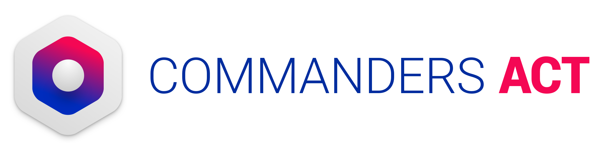

# @commandersact/tcconsent-react-native

CommandersAct's TCConsent mobile SDK bridge for React Native.

This module manages your users' consent: displaying a consent UI (Privacy Center and/or Consent Banner), saving consent on the device, checking its validity, and forwarding it to the ServerSide module. It can:

- Display a Privacy Center and/or a Consent Banner.
- Save consent on the device and reload it on every launch.
- Check consent validity (default: 6 months).
- Send a hit to our servers to record consent, and hits for statistical purposes.
- Save the IAB TCF v2 consent string (when the TCIAB module is linked).
- Forward consent to your app via events if you need it outside of the module.
- If used alongside `@commandersact/tcserverside-react-native`: automatically enable/disable ServerSide and tag its hits with consent categories.

This bridge wraps the native [iOS](#related-documentation) and [Android](#related-documentation) TCConsent SDKs — this README covers the React Native API surface; native behaviour, JSON configuration, and IAB specifics are documented in full in the native guides linked under [Related Documentation](#related-documentation).

## Table of Contents

- [Installation](#installation)
  - [1. Choose your package](#1-choose-your-package)
  - [2. Install](#2-install)
  - [3. iOS setup](#3-ios-setup)
  - [4. Android setup](#4-android-setup)
  - [5. Configuration files](#5-configuration-files)
  - [Minimum requirements](#minimum-requirements)
- [Choosing your setup](#choosing-your-setup)
- [Quick start](#quick-start)
- [API Reference](#api-reference)
  - [Initialisation](#initialisation)
  - [IAB / TCIAB configuration](#iab--tciab-configuration)
  - [Saving consent manually](#saving-consent-manually)
  - [Accept / refuse all](#accept--refuse-all)
  - [Consent Banner](#consent-banner)
  - [Privacy Center](#privacy-center)
  - [Reacting to consent](#reacting-to-consent)
  - [Consent internal API — TCConsentAPI](#consent-internal-api--tcconsentapi)
  - [Privacy statistics](#privacy-statistics)
  - [Managing consent](#managing-consent)
  - [Forwarding consent to webViews](#forwarding-consent-to-webviews)
  - [External consent & TCUser](#external-consent--tcuser)
- [Quick Reference — Function Recap](#quick-reference--function-recap)
- [Related Documentation](#related-documentation)
- [Demo App](#demo-app)
- [Versions compatibility](#versions-compatibility)
- [Troubleshooting](#troubleshooting)
- [Support & Contact](#support--contact)

## Installation

### 1. Choose your package

TCConsent is published as two npm packages, built from the same source. Pick the one matching whether you need IAB/TCF support:

| Package | When to use it | Notes |
|---|---|---|
| [`@commandersact/tcconsent-react-native`](https://www.npmjs.com/package/@commandersact/tcconsent-react-native) | You use IAB/TCF, or might in the future | Includes the native TCIAB dependency. `customPCMSetSiteID` and the `saveConsent*` family are **not available** in this package — IAB compliance requires consent to be collected through a validated UI (see [Choosing your setup](#choosing-your-setup)). |
| [`@commandersact/tcconsent-react-native-noiab`](https://www.npmjs.com/package/@commandersact/tcconsent-react-native-noiab) | Pure non-IAB integration | Excludes the native TCIAB dependency (smaller footprint). All functions are available, including `customPCMSetSiteID` and `saveConsent*` for fully custom consent UIs. |

> [!IMPORTANT]
> Whichever you pick, import from that exact package name in your app code (e.g. `from '@commandersact/tcconsent-react-native-noiab'`) — the two are not interchangeable at the import level. If you're unsure which one you need, use the default (IAB) package; contact your account manager if you're not sure whether you'll need IAB.

You will also need [`@commandersact/tccore-react-native`](https://www.npmjs.com/package/@commandersact/tccore-react-native), which both variants depend on. See [Related Documentation](#related-documentation).

### 2. Install

```sh
npm install @commandersact/tcconsent-react-native @commandersact/tccore-react-native
```

or

```sh
yarn add @commandersact/tcconsent-react-native @commandersact/tccore-react-native
```

(swap in `@commandersact/tcconsent-react-native-noiab` if that's your chosen variant)

### 3. iOS setup

No manual Podfile edits are required — the package autolinks via CocoaPods. Once installed, navigate to your `ios/` directory and run:

```sh
pod install
```

### 4. Android setup

No extra step is needed — the module is autolinked.

### 5. Configuration files

Depending on your setup, you may need one or more of these offline JSON files, bundled in **both** your Android and iOS native app code:

| File | Needed when |
|---|---|
| `privacy.json` | You use our Privacy Center and/or Consent Banner. Provided by your CommandersAct consultant. |
| `vendor-list.json` | You use the IAB module. |
| `purposes-xx.json` | You use IAB with a translation for language `xx`. |
| `TCIABPublisherRestrictions.json` | Optional — your company applies publisher restrictions to IAB partners. |
| `google-atp-list.json` | Optional — you use Google AC String. |

**Android:** place these files in the `assets` folder of your main app module.

**iOS:** bundle these files with your main app bundle — Xcode target → Build Phases → Copy Bundle Resources.

See the [Privacy JSON Documentation](#related-documentation) for the full schema.

### Minimum requirements

- iOS 13.0+
- Android API 21+

## Choosing your setup

Before writing any code, decide on two independent choices — they combine freely.

**Modules configuration:**

- **With ServerSide** (`@commandersact/tcserverside-react-native` also installed) — the module automatically starts/stops ServerSide based on saved or incoming consent, and tags its hits with consent categories. Nothing extra to manage.
- **Standalone** — consent is still saved and events still fire, but you're responsible for enabling/disabling your own third-party SDKs based on what comes back from [`addConsentUpdatedListener`](#reacting-to-consent).

**Consent flavour:**

- **Non-IAB** (`@commandersact/tcconsent-react-native-noiab`) — consent is collected against your own custom categories/vendors as defined in `privacy.json`, or passed manually to `saveConsent*`.
- **IAB** (`@commandersact/tcconsent-react-native`) — adds IAB TCF v2 support. The Privacy Center gains an IAB-compliant first layer, and its category/vendor screen includes IAB purposes and vendors alongside your own. See the [TCIAB documentation](#related-documentation) for AC String and publisher-restrictions setup.

> [!WARNING]
> `saveConsentFromPopUp`, `saveConsent`, `saveConsentFromConsentSourceWithPrivacyAction`, and `customPCMSetSiteID` cannot be used with IAB — the SDK cannot generate a TCF-compliant consent string from a UI it doesn't control. In IAB mode use `acceptAllConsent()` / `refuseAllConsent()` for all-or-nothing consent, or the Privacy Center for granular per-category/per-vendor consent. This is also why these functions are excluded from the IAB npm package entirely (see [Choose your package](#1-choose-your-package)).

**UI components:**

- **Privacy Center** (`showPrivacyCenter`) — the full consent management screen. Behaviour adapts automatically depending on whether you're on the IAB or non-IAB package — no code change needed. Can act as a first layer (IAB) or be reached from your own/our first layer as a second layer.
- **Consent Banner** (`showBanner`, **non-IAB only**) — a lightweight first-layer UI to quickly collect consent before optionally opening the Privacy Center or your own screen. If you're on the IAB package, the Privacy Center already handles the first layer — you don't need `showBanner()`.

> [!IMPORTANT]
> If you're unsure which combination fits your project, contact your account manager.

## Quick start

```tsx
import * as TCConsent from '@commandersact/tcconsent-react-native';

// Register listeners before initialising — the module checks consent at init
// and fires callbacks immediately.
TCConsent.addConsentUpdatedListener((consent) => {
  console.log('consent updated', consent);
});

// Initialise (our UI, privacy.json required)
await TCConsent.setSiteIDPrivacyID(3311, 2929);

// Show the Privacy Center
TCConsent.showPrivacyCenter();

// Or, show the lightweight first-layer banner (non-IAB only)
TCConsent.showBanner(TCConsent.ETCBannerType.BOTTOM, {}, () => {
  TCConsent.showPrivacyCenter();
});

// Accept/refuse consent directly, without displaying any UI
TCConsent.acceptAllConsent();
TCConsent.refuseAllConsent();
```

## API Reference

### Initialisation

Register your event listeners (see [Reacting to consent](#reacting-to-consent)) **before** calling either of these — the module checks saved consent at init and fires callbacks immediately.

```ts
// With our UI (Privacy Center and/or Banner) — privacy.json required
await TCConsent.setSiteIDPrivacyID(siteId: number, privacyID: number): Promise<void>

// Without our UI — you're building your own consent screens entirely. Non-IAB package only.
TCConsent.customPCMSetSiteID(siteId: number, privacyID: number): void
```

At init, the module checks saved consent and puts ServerSide on hold if nothing is found; once consent is given or loaded, ServerSide is started or stopped accordingly.

### IAB / TCIAB configuration

```ts
// Enable Google AC String. Call before initialising. Requires google-atp-list.json.
TCConsent.useACString(value: boolean): void

// Apply your TCIABPublisherRestrictions.json. Call right after initialising.
TCConsent.useCustomPublisherRestrictions(): void

// Set the language for IAB purpose/vendor translations (ISO 639-1). Call right after initialising.
await TCConsent.setLanguage(languageCode: string): Promise<void>
```

### Saving consent manually

> [!WARNING]
> Non-IAB package only — see [Choosing your setup](#choosing-your-setup). If you build your own consent UI, once the user validates their choice, pass it to the module. Category IDs are prefixed `PRIVACY_CAT_`, vendor IDs `PRIVACY_VEN_`; values are `"1"` (accepted), `"2"` (mandatory), `"0"` (refused).

```ts
// From your own first-layer popup/banner
TCConsent.saveConsentFromPopUp(consent: { [key: string]: string }): void

// From your own Privacy Center screen
TCConsent.saveConsent(consent: { [key: string]: string }): void

// Universal entry point — specify the source and the action explicitly
TCConsent.saveConsentFromConsentSourceWithPrivacyAction(
  consent: { [key: string]: string },
  source: TCConsent.ETCConsentSource,     // POP_UP | PRIVACY_CENTER
  action: TCConsent.ETCConsentAction      // ACCEPT_ALL | REFUSE_ALL | SAVE
): void
```

When passing `ACCEPT_ALL` or `REFUSE_ALL`, the SDK treats the action as the source of truth — you don't need every category in the map to match.

### Accept / refuse all

Available in both packages, from either our UI or your own:

```ts
TCConsent.acceptAllConsent(): void
TCConsent.refuseAllConsent(): void
```

> [!NOTE]
> On the IAB package, these are the **only** programmatic consent methods — for manual per-category/per-vendor consent under IAB, use the Privacy Center.

### Consent Banner

Non-IAB only. A lightweight first-layer UI; its Details button opens the Privacy Center or any screen of your own.

```ts
TCConsent.showBanner(
  type?: TCConsent.ETCBannerType,               // BOTTOM (default) | FULL_SCREEN
  options?: TCConsent.TCBannerOptions,
  onDetails?: () => void,
  colorScheme?: TCConsent.TCBannerColorScheme
): void
```

`TCBannerOptions` — all fields optional, native defaults applied for anything omitted:

| Option | Description | Default |
|---|---|---|
| `dimAmount` | Background dim level behind the banner (0–1) | `0.4` |
| `isDismissible` | Allow dismissal by tapping outside. ⚠️ No consent is collected this way | `false` |
| `iconName` | Image asset (iOS) / drawable resource (Android) shown before the title | none |
| `iconSize` | Size of that icon | `50` |
| `buttonsAlignment` | `ETCButtonsAlignment.HORIZONTAL` \| `VERTICAL` | `VERTICAL` |
| `buttonsOrder` | Order of `ETCBannerButton.ACCEPT` / `REFUSE` / `DETAILS` | `[REFUSE, DETAILS, ACCEPT]` |
| `compactLayout` | Reduced visual weight. Only enable if it still meets your local regulations — the refuse option becomes visually less prominent | `false` |

`colorScheme` (`TCBannerColorScheme`) — optional light/dark override, `{ light: { background, textColor }, dark: { background, textColor } }` as hex strings (with or without `#`):

- **iOS** — named asset-catalogue colours (`TCBannerBackground` / `TCBannerTextColor`) still take priority over `colorScheme` if defined; falls back to system colours if neither is set.
- **Android** — `colorScheme` overrides the app's inherited Material 3 theme colours (`colorSurface` / `colorOnSurface`); falls back to Material 3 defaults.

Accept/Refuse buttons call `acceptAllConsent()` / `refuseAllConsent()` internally; Details triggers `onDetails`. Privacy statistics are collected automatically on display and on every button tap.

> [!IMPORTANT]
> On Android, `showBanner()` must be called while the app is in the foreground with a `FragmentActivity` current activity — it silently logs an error and does nothing otherwise.

### Privacy Center

```ts
TCConsent.showPrivacyCenter(
  startScreen?: TCConsent.EPrivacyCenterStartScreen  // kTCStartWithDefault (default) | kTCStartWithVendorScreen | kTCStartWithPurposeScreen
): void
```

Use `startScreen` to jump straight to the vendor or purpose screen — useful if you have your own first-layer screen and want to skip the IAB first layer on Privacy Center launch.

### Reacting to consent

Register listeners **before** initialising — the module checks consent at startup and fires callbacks immediately. Each function returns an `EmitterSubscription`; call `.remove()` on it to unsubscribe.

```ts
// Fires at startup, after the Privacy Center saves consent, or after any saveConsent* call.
// Map contains PRIVACY_CAT_n / PRIVACY_VEN_n keys with "0"/"1" values; may be empty.
TCConsent.addConsentUpdatedListener(
  callback: (consent: { [key: string]: string }) => void
): EmitterSubscription

// Fires once the consent validity duration has elapsed with no change (default: 6 months).
// Use it to force re-displaying the consent screen.
TCConsent.addConsentOutdatedListener(callback: () => void): EmitterSubscription

// Fires when a category is added, removed, or its ID changes in privacy.json.
// Re-display the Privacy Center when this fires.
TCConsent.addConsentCategoryChangedListener(callback: () => void): EmitterSubscription

// IAB only. Fires only when "significantChanges" is set in privacy.json — not automatic.
TCConsent.addSignificantChangesInPrivacyListener(callback: () => void): EmitterSubscription
```

To unsubscribe:

```ts
const subscription = TCConsent.addConsentUpdatedListener(onConsentUpdated);
// later
subscription.remove();
```

### Consent internal API — TCConsentAPI

Utility methods to check consent state at any time, from `TCConsentAPI`:

```ts
import { TCConsentAPI } from '@commandersact/tcconsent-react-native';

TCConsentAPI.shouldDisplayPrivacyCenter(): Promise<boolean>
TCConsentAPI.isConsentAlreadyGiven(): Promise<boolean>
TCConsentAPI.getLastTimeConsentWasSaved(): Promise<number>   // epoch timestamp, 0 if never

TCConsentAPI.isCategoryAccepted(ID: number): Promise<boolean>
TCConsentAPI.isVendorAccepted(ID: number): Promise<boolean>

TCConsentAPI.getAcceptedCategories(): Promise<string[]>       // PRIVACY_CAT_ids
TCConsentAPI.getAcceptedVendors(): Promise<string[]>           // PRIVACY_VEN_ids
TCConsentAPI.getAcceptedGoogleVendors(): Promise<string[]>     // acm_ids
TCConsentAPI.getAllAcceptedConsent(): Promise<string[]>        // everything accepted

// IAB only — requires the IAB package with TCIAB linked.
TCConsentAPI.isIABPurposeAccepted(ID: number): Promise<boolean>
TCConsentAPI.isIABVendorAccepted(ID: number): Promise<boolean>
TCConsentAPI.isIABSpecialFeatureAccepted(ID: number): Promise<boolean>
```

### Privacy statistics

Our rendered UI (Privacy Center, Consent Banner) already calls these internally — you only need them if you built your own consent screens.

```ts
TCConsent.statEnterPCToVendorScreen(): void
TCConsent.statShowVendorScreen(): void
TCConsent.statViewPrivacyPoliciesFromPrivacyCenter(): void
TCConsent.statViewPrivacyCenter(): void
TCConsent.statViewBanner(): void
await TCConsent.statViewPrivacyPoliciesFromBanner(): Promise<void>
```

To stop privacy statistics tracking entirely:

```ts
await TCConsent.do_not_track(value: boolean): Promise<void>
```

### Managing consent

```ts
// Reset all saved consent on the device. Managing resets per app version is your responsibility.
await TCConsent.resetSavedConsent(): Promise<void>

// Get/set the consent version manually (e.g. when using your own Privacy Center).
await TCConsent.getConsentVersion(): Promise<string>
await TCConsent.setConsentVersion(consentVersion: string): Promise<void>

// Change consent validity duration in code (default 6 months). Call before init.
// Can also be set via privacy.json's "consentDurationInMonths".
TCConsent.setConsentDuration(months: number): void

// Sets the consent switches' initial state the first time the Privacy Center is shown.
await TCConsent.switchDefaultState(value: boolean): Promise<void>

// Android only — disable the Privacy Center's back button to force a consent choice.
await TCConsent.deactivateBackButton(value: boolean): Promise<void>

// Android only — by default a freshly-fetched privacy.json from our CDN is parsed and
// applied immediately. Pass false to defer parsing until the next app launch instead
// (useful if your configuration is large enough to block the main thread).
await TCConsent.shouldForceJsonUpdate(value: boolean): Promise<void>
```

Consent is saved to our servers automatically, identified by `TCUserInstance.consentID` (see [External consent & TCUser](#external-consent--tcuser)). If you need to prove consent or reset saved information, build a dedicated screen using that ID.

### Forwarding consent to webViews

```ts
await TCConsent.getConsentAsJson(): Promise<string>
```

Returns the current consent state as a formatted JSON string — save it into your `WebView`'s local storage. You'll still need JS code inside the web container to consume it; contact your consultant for that part.

### External consent & TCUser

`consentID`, and forwarding consent from a system entirely external to CommandersAct (`external_consent`), are exposed through `TCUserInstance` from `@commandersact/tccore-react-native`, not from this package — see its [README](https://www.npmjs.com/package/@commandersact/tccore-react-native) for details.

## Quick Reference — Function Recap

> [!NOTE]
> TCConsent functions are use-case dependent — whether you use **our UI** (Privacy Center / Banner) or a **Custom UI**, and whether you're on the **IAB** or **Non-IAB** package. This maps every function to the setup it belongs to.

| Function | UI ownership | Package | Notes |
|---|---|---|---|
| `setSiteIDPrivacyID` | Our UI | Both | Standard init when using Privacy Center and/or Banner. `privacy.json` required. |
| `customPCMSetSiteID` | Custom UI | **Non-IAB only** | Not published in the IAB package at all. |
| `saveConsentFromPopUp` / `saveConsent` / `saveConsentFromConsentSourceWithPrivacyAction` | Custom UI only | **Non-IAB only** | Not published in the IAB package at all. |
| `acceptAllConsent` / `refuseAllConsent` | Our UI or Custom UI | Both | On IAB, the **only** programmatic consent functions. |
| `showBanner` | Our UI | Both | **Non-IAB flow only** — not supported for IAB setups; use the Privacy Center instead. |
| `showPrivacyCenter` | Our UI | Both | Adapts automatically to IAB vs non-IAB — no code change needed. |
| `useACString` / `useCustomPublisherRestrictions` | — | Both | **IAB only** — no effect without TCIAB linked (i.e. on the non-IAB package). |
| `addConsentUpdatedListener` and other `add*Listener` | Either | Both | Fire regardless of UI ownership or consent flavour. |
| `stat*` functions | Custom UI only | Both | Our rendered UI already calls these internally. |
| `TCConsentAPI.*` | Both | Both | IAB-specific getters (`isIABPurposeAccepted`, etc.) always resolve falsy without TCIAB linked. |
| `switchDefaultState` / `do_not_track` | Our UI | Both | — |
| `deactivateBackButton` / `shouldForceJsonUpdate` | Our UI | Both | **Android only.** |
| `TCUserInstance.consentID` / `external_consent` (via tccore) | Both | Both | Defaults to an internal ID; override to use your own (needed to retrieve consent proof later). |
| `privacy.json` | Our UI: required | Both | Mandatory offline copy if using Privacy Center and/or Banner. |

## Related Documentation

| Document | When you need it |
|---|---|
| [`tccore-react-native`](https://www.npmjs.com/package/@commandersact/tccore-react-native) | `TCUserInstance` (user identification, `consentID`, `external_consent`) and `TCDebugInstance` (native debug logging) — required alongside this package. |
| Native SDK documentation — [Android](https://github.com/CommandersAct/androidV5/tree/master/TCConsent), [iOS](https://github.com/CommandersAct/iOSV5/tree/master/TCConsent) | Full native behaviour this bridge wraps — consent layers, retaining consent, testing your integration, callback semantics. |
| Native SDK changelogs — [Android](https://github.com/CommandersAct/AndroidV5/releases/tag/5.6.0), [iOS](https://github.com/CommandersAct/iOSV5/releases/tag/5.5.1) | What changed in the native SDK version this bridge currently targets. |
| Privacy JSON Documentation (in the native SDK repos, `res/Privacy_JSON_Documentation.md`) | Configuring `privacy.json` — categories, vendors, texts, banner content, Google Consent Mode mapping. |
| Building Your Own Privacy Center (in the native SDK repos, `res/user_privacy_center.md`) | You are **not** using our Privacy Center and are building a fully custom consent UI — documents every `stat*`/`saveConsent*` call your UI needs to make. |
| TCIAB documentation (in the native SDK repos, `TCIAB/README.md`) | IAB/TCF integration in depth, AC String setup, publisher restrictions, filtering vendors. |

## Demo App

A full working React Native app integrating this library: [TCDemoReactNative](https://github.com/CommandersAct/TCDemoReactNative)

## Versions compatibility

TCConsent depends on `@commandersact/tccore-react-native` as a peer dependency, pinned to a specific version each release — npm will warn you of a mismatch. If you also use `@commandersact/tcserverside-react-native`, keep all three in sync:

```sh
npm install @commandersact/tccore-react-native@latest
npm install @commandersact/tcconsent-react-native@latest
npm install @commandersact/tcserverside-react-native@latest
```

> [!NOTE]
> Native iOS dependencies use fixed versions in the podspec to prevent unwanted auto-upgrades. Mixing versions across packages may cause linking failures.

## Troubleshooting

### Enabling native debug logs

To see what the native SDKs are doing (including the consent hits described in the native guides' "Testing your integration" section), enable verbose native logging via `@commandersact/tccore-react-native`:

```tsx
import { TCDebugInstance } from '@commandersact/tccore-react-native';

TCDebugInstance.enableNativeDebug();
// TCDebugInstance.disableNativeDebug();
```

Check your Xcode console / Logcat for a `CommandersAct: sending: https://privacy.trustcommander.net/privacy-consent/...` entry after accepting or refusing consent — if you don't see it, confirm logging is enabled and that one of the save/accept/refuse functions was actually called.

### iOS build issues

On iOS, library linking can be fragile and cached build artifacts may become corrupted. If you encounter dependency issues, `_OBJ_CLASS_$_` errors, or "not found" build failures, work through these steps in order:

1. Delete your `node_modules` folder.
2. Remove `package-lock.json`.
3. Close Xcode if it's open.
4. Run `npm install` to reinstall dependencies.
5. Delete `ios/Podfile.lock`.
6. Remove the `ios/Pods` folder.
7. Run `pod install` inside the `ios/` directory.
8. If the issue persists, open Xcode, clean the build folder (⌘⇧K), and run the app from the `.xcworkspace` file.

## Support & Contact

Support: support@commandersact.com

http://www.commandersact.com

Commanders Act | 25 rue de Tolbiac - 75013 PARIS - France


